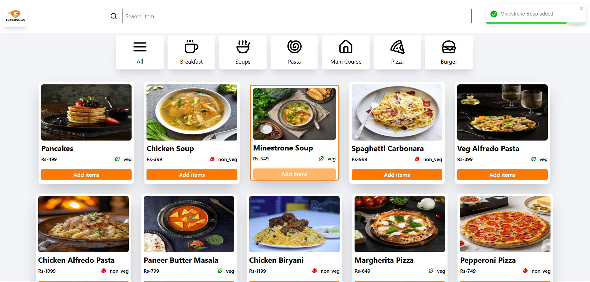
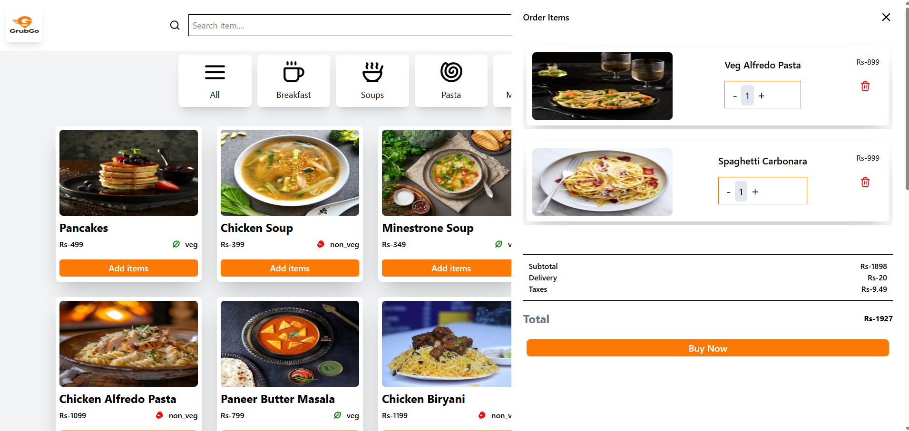
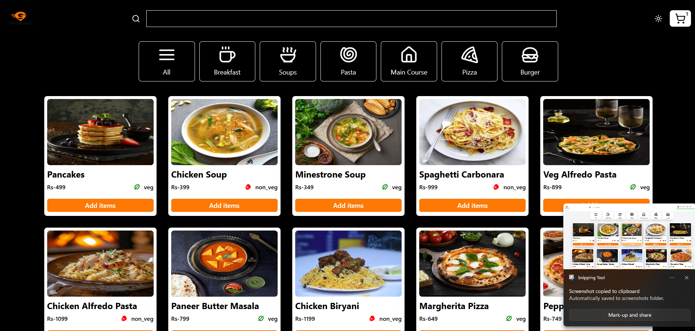

# 🍔 GrubGo

GrubGo is a modern **Food Delivery Web App** built with **React, Vite, TailwindCSS, Redux Toolkit, Context API, and React Toastify**.  
It allows users to explore food categories, add items to the cart, switch between **dark/light mode**, and experience smooth responsive design.

---

## 🚀 Features
- 🌗 **Dark & Light Theme Toggle**
- 🛒 **Add to Cart, Remove from Cart**
- 🍕 **Filter Food by Categories (Pizza, Burger, Drinks, etc.)**
- 🔥 **State Management with Redux Toolkit + Context API**
- 🎨 **TailwindCSS Styling**
- 📱 **Fully Responsive UI**
- ⚡ **Optimized with Vite**

---

## 🖼️ Screenshots

### 🏠 Home Page


### 🛒 Cart Page


### 🌙 Dark Mode

---

## 🛠️ Tech Stack
- **React + Vite**
- **Tailwind CSS**
- **Redux Toolkit**
- **Context API**
- **React Toastify**

---

## ⚡ Installation

Clone the repository and install dependencies:

```bash
git clone https://github.com/GAUTAMBISOI/GrubGo.git
cd GrubGo
npm install
npm run dev
🌍 Deployment

This project is deployed using GitHub Pages.
🔗 Live Demo → GrubGo

📌 Author

👨‍💻 Gautam Bisoi
Passionate about Frontend Development, React, and Web Animations 🚀
